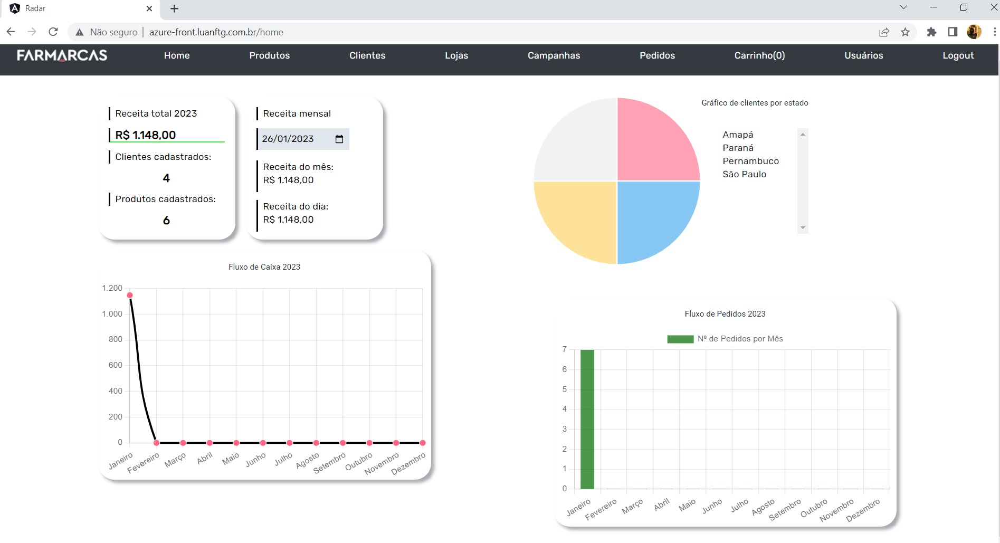
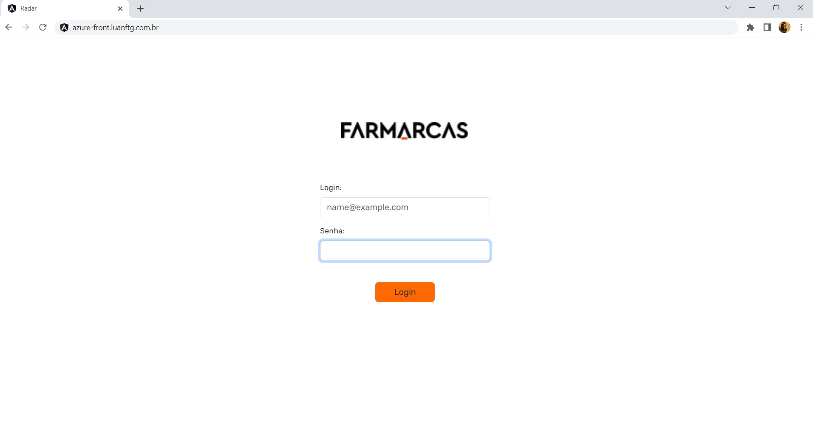
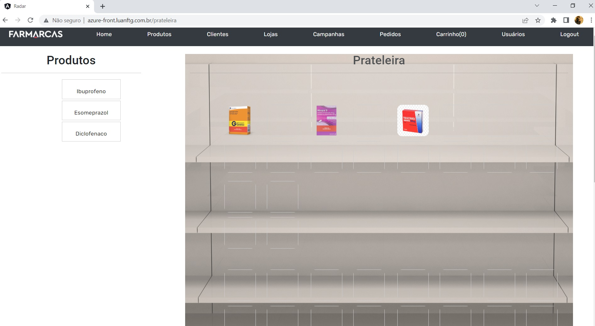
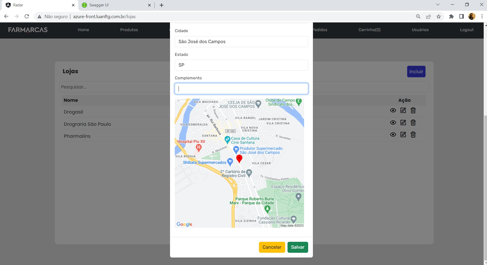

<h1> Projeto Radar - Código do Futuro

# :computer:  Equipe de DESENVOLVEDORES

<table align="center">
  <tr>
    <td align="center">
      <a href="https://github.com/GuiHSM">
         
        
          <b>Guilherme Marcelino</b>
        
      </a>
    </td>
    <td align="center">
      <a href="https://github.com/Luanftg">
         
        
          <b>Luan F. T. Gimenez</b>
        
      </a>
    </td>
    <td align="center">
      <a href="https://github.com/bruno-esilva">
         
        
          <b>Bruno Ernandes da Silva</b>
        
      </a>
    </td>
    <td align="center">
      <a href="https://github.com/Rfalcao11">
         
        
          <b>Rafael Falcão</b>
        
      </a>
    </td>
    <td align="center">
      <a href="https://github.com/luisedu24">
         
        
          <b>Luis Eduardo</b>
        
      </a>
    </td>
    </tr>
</table>

## Desafio

*Muito bem agora com o front-end concluído do primeiro desafio, iremos construir uma API para que possamos ter o controle interno sobre as informações de nosso sistema Radar*

[Link para o repositório da API](https://github.com/Luanftg/codigo-do-futuro-api-dotnet)

- [x] :star: Registro de domínio
- [x] :star: Hospedagem: **Azure**
  - Fron-End - Projeto Radar [http://azure-front.luanftg.com.br/](http://azure-front.luanftg.com.br/)
  - API - Projeto Radar [http://azure-api.luanftg.com.br/swagger/index.html](http://azure-api.luanftg.com.br/swagger/index.html)

## Solução

*Com o desafio de assumir o controle interno sobre as informações do sistema Radar, foram implementadas:*

- seções com novas abas de **funiconalidades** como

- [x] :star: `/usuarios` - administrador da aplicação Radar
- [x] :star: `/lojas`
- [x] :star: `/pedidos`
- [x] :star: `/pedidos-produtos`
- [x] :star: `/posicoes-produtos`

### Segurança

- :star:Persistência segura de seção utilizando **token JWT** salvo localmente no navegador após login.

### Usabilidade

- :star: **Prateleira de produtos** desenvolvida como um componente angular utilizando o *Material DragDropModule* promovendo uma interação intuitiva e visual da disposição dos produtos na prateleira do estabelecimento.

### Comunicação com Serviços

- [x] :star: Utilização da **API do google maps** para mostrar o mapa no cadastro de loja;
- [x] :star: Utilização da **API do Via Cep** para busca de enderços via CEP.

#### Referências

- [Desafio Final - Codigo do Futuro](https://docs.google.com/document/d/1z0wzqAeLgMYQFg_jFOTQ1xj_BF1Byo7D/edit)
- [Projeto Front-End base para este desafio - Sungjuno](https://github.com/Sungjuno/projeto-radar)
